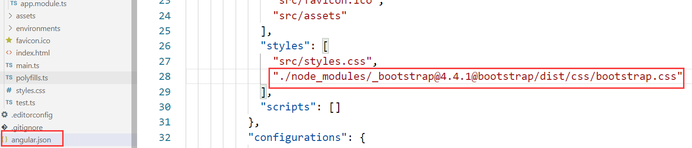

**目录**

***

[TOC]

#ng1

## 了解AngularJS

1、AngularJS 诞生于2009年，由Misko Hevery 等人创建，后为Google所收购。是一款优秀的前端JS框架，已经被用于Google的多款产品当中。AngularJS有着诸多特性，最为核心的是：MVC（Model–view–controller）、模块化、自动化双向数据绑定、语义化标签、依赖注入等等。

2、AngularJS 是一个 [**JavaScript**](https://baike.baidu.com/item/JavaScript)**框架**。它是一个以 JavaScript 编写的库。它可通过 \<script\> 标签添加到[HTML](https://baike.baidu.com/item/HTML) 页面。

3、AngularJS 通过 **指令** 扩展了 HTML，且通过 **表达式** 绑定数据到 HTML。

4、AngularJS 是以一个 JavaScript 文件形式发布的，可通过 script 标签添加到网页中。

5、AngularJS 这套Js框架针对于SPA(Single-Page-Application)应用。


## CLI

CLI是一个工具，可以将Angular项目中的ts代码编译成浏览器可以解析的js代码。

##查看电脑上Angular CLI的版本信息

通过命令：ng --version

##创建第一个Angular项目

ng new my-first-angular-app

如果安装过慢可以Ctrl+c打断，

然后cd 进入新建的项目：cd my-first-angular-app，

再通过cnpm install 进行安装。


通过ng serve  来启动项目

设置指定端口启动项目：

​		ng serve --port 8888


## Angular项目目录结构详解

**首层目录：**

- 【node_modules  】      第三方依赖包存放目录
- 【e2e   】              端到端的测试目录  用来做自动测试的
- 【src  】               应用源代码目录
- 【.angular-cli.json  】 Angular命令行工具的配置文件。后期可能会去修改它，引一些其他的第三方的包  比如jquery等
   -【 karma.conf.js】       karma是单元测试的执行器，karma.conf.js是karma的配置文件
- 【package.json  】      这是一个标准的npm工具的配置文件，这个文件里面列出了该应用程序所使用的第三方依赖包。实际上我们在新建项目的时候，等了半天就是在下载第三方依赖包。下载完成后会放在node_modules这个目录中，后期我们可能会修改这个文件。
- 【protractor.conf.js】  也是一个做自动化测试的配置文件
- 【README.md】           说明文件
- 【tslint.json】         是tslint的配置文件，用来定义TypeScript代码质量检查的规则，不用管它


**src目录：**

- **app目录**             包含应用的组件和模块，我们要写的代码都在这个目录

- **assets目录**            资源目录，存储静态资源的  比如图片

- **environments目录**      环境配置。Angular是支持多环境开发的，我们可以在不同的环境下（开发环境，测试环境，生产环境）共用一套代码，主要用来配置环境的

- **index.html**          整个应用的根html，程序启动就是访问这个页面

- **main.ts**             整个项目的入口点，Angular通过这个文件来启动项目

- **polyfills.ts**        主要是用来导入一些必要库，为了让Angular能正常运行在老版本下

- **styles.css**          主要是放一些全局的样式

- **tsconfig.app.json**   TypeScript编译器的配置,添加第三方依赖的时候会修改这个文件

- **tsconfig.spec.json**  不用管

- **test.ts**             也是自动化测试用的

- **typings.d.ts**        系统模块定义文件

  

**app目录（重点）**

app.component.css：样式文件

app.component.html：模板文件

app.component.spec.ts：单元测试文件

app.component.ts：是typescript脚本文件

app.module.ts：数据模型定义文件


## ngModel指令的操作

在页面中的代码：

```html
<div style="text-align: center;">
  <h1>
    Welcom to {{title}}
  </h1>
  <input type="text" [(ngModel)]="name">
  <hr>
  {{name}}
</div>
```


此时运行项目不起作用，而且控制台报错：

还需要引入forms模块：


运行结果：


# ng2

## 引入BootStrap框架

1、安装bootStrap

```
通过命令：cnpm i bootstrap -s
```

2、



3、在app组件的模板页面添加内容


启动项目，页面效果：


```
<body>
  <app-root>Loading...</app-root>
</body>
```

**\*: angualr项目由webpack打包，在未打包完成前，页面显示Loading...，打包完成后， \<app-root\>标签生效替换里面的内容**


## 创建组件(在app根组件下创建)

步骤：

1. 在app文件夹下新建serve文件夹；

2. 在serve里面新建文件：serve.component.ts：

   ```
   import { Component } from '@angular/core';
   
   
   @Component({
       selector:"serve-app",
       templateUrl:"./serve.component.html",
       styleUrls: ['./serve.component.css']
   })
   
   export class ServeComponent {
   
     }
   ```

3. 新建文件：serve.component.html、serve.component.css

**在app.module.ts中声明ServeComponent组件**

```
import { BrowserModule } from '@angular/platform-browser';
import { NgModule } from '@angular/core';

import { AppRoutingModule } from './app-routing.module';
import { AppComponent } from './app.component';
import { ServeComponent } from './serve/serve.component';

@NgModule({
  declarations: [
    AppComponent,
    ServeComponent
  ],
  imports: [
    BrowserModule,
    AppRoutingModule
  ],
  providers: [],
  bootstrap: [AppComponent]
})
export class AppModule { }

```

**调用serve组件**


## 自动创建组件

通过命令创建serves组件

```
PS F:\month\angular\ng2\my-app> ng generate componet serves
```

或者通过缩写模式

```
PS F:\month\angular\ng2\my-app> ng g c reserve
```


通过template引入其他的组件：

```
import { Component, OnInit } from '@angular/core';

@Component({
  selector: 'app-serves',
  //templateUrl: './serves.component.html',
  template:`
      <serve-app></serve-app>
      <serve-app></serve-app>
  `,
  styleUrls: ['./serves.component.css']
})
export class ServesComponent implements OnInit {

  constructor() { }

  ngOnInit() {
  }

}
```

app.component.css中写css样式：

```
p{
    color:red;
}
```

**或者直接在app.component.ts的@Component修饰器中写css样式：**

```
import { Component } from '@angular/core';

@Component({
  selector: 'app-root',
  templateUrl: './app.component.html',
  //styleUrls: ['./app.component.css']
  styles:[
    `
      p{
        font-size:30px;
        color:pink;
        text-align:center;
      }
    `
  ]
})
export class AppComponent {
  title = 'my-app';
}

```

**selector中的写法以及html的使用方式**

通过标签

```
selector: 'serve-app'
html中的使用方式：<serve-app></serve-app>
```

## 数据绑定

插值表达式：{{index}}

属性绑定：[属性名]="变量名"

组件的html页面内容：

```
<h1>
    我是serve组件
    编号是：{{serveId}}   状态是1：{{serveStatus}} - 状态是2：{{getStatus()}}
    字符串：{{"我是字符串"}}
</h1>
```

ts中的内容：

```
export class ServeComponent {
    serveId:number = 10;
    serveStatus:string = '离线';

    getStatus(){
      return this.serveStatus;
    }
  }
```

属性绑定：

html中：

```
<button style="background-color: aquamarine;" [disabled]="allow">按钮</button>
```

ts中：

```
export class ReserveComponent implements OnInit {
  allow = true;
  constructor() {
      setTimeout(() => {
        this.allow = false;
      }, 2000);
   }

  ngOnInit() {
  }

}
```

**插值表达式与属性绑定的区别**

如果插值表达式处理的是字符串时与属性绑定没有区别，插值表达式处理的是判断，bool，叠加等等，我们只能使用属性绑定的方式。

## 模板页向业务逻辑进行事件触发

html中添加点击事件：

```
<button 
    style="background-color: aquamarine;" 
    (click)="onClick()"
    [disabled]="allow"
    >按钮</button>

<p>{{allow}}</p>
<p [innerText]="allow"></p>

<p>创建状态：{{createStatus}}</p>
```

ts中：

```
import { Component, OnInit } from '@angular/core';

@Component({
  selector: 'app-reserve',
  templateUrl: './reserve.component.html',
  styleUrls: ['./reserve.component.css']
})
export class ReserveComponent implements OnInit {
  allow = true;
  createStatus = "还没有被创建";

  constructor() {
      setTimeout(() => {
        this.allow = false;
      }, 2000);
   }

  ngOnInit() {
  }

  onClick(){
    this.createStatus = "已经创建";
  }

}
```

## 数据绑定到事件

html中：

```
<input type="text" (input)="onUpdate($event)">

{{serveName}}
```

ts中：

```
serveName = '';

onUpdate(event:any){
    //console.log(event);
    this.serveName = event.target.value;
  }
```

## 双向数据绑定

html中：

```
<input type="text" [(ngModel)]="serveName">

{{serveName}}
```

**再到app.module.ts中引入FormsModule模块**

与数据绑定到事件的区别：

```
<input type="text" (input)="onUpdate($event)">
<input type="text" [(ngModel)]="serveName">

{{serveName}}
```


# ng3

##判断指令：***ngIf**

html内容：

```
<p *ngIf="createIf">{{showMsg}}</p>
```

createIf为true显示，false不显示。

**添加else**

```html
if下的内容：<p *ngIf="createIf;else noserve">{{showMsg}}</p>
<ng-template #noserve>
    <p>没有任何内容</p>
</ng-template>
```

## 控制样式指令

[ngStyle]、[ngClass]

```
<p [ngStyle]="{backgroundColor:backColor}" [ngClass]="{online: createIf==true}">背景色</p>

```

##循环指令：*ngFor

```
<div *ngFor="let s of arrs;let i = index;let odd = odd" [ngStyle]="{color: i>5?'skyblue':'green'}">{{s}}-{{i}}-{{odd}}</div>
```

## 基础知识项目应用

1. 创建my-project文件夹；

2. 安装bootstrap：cnpm i bootstrap -s

3. 引入       "./node_modules/_bootstrap@4.4.1@bootstrap/dist/css/bootstrap.css"

4. 创建组件

   ```
   //创建recipes组件  --spec false：将不会创建测试组件
   ng g c recipes --spec false
   
   //创建列表组件
   ng g c recipes/recipe-list --spec false
   
   //创建详情组件
   ng g c recipes/recipe-detail --spec false
   
   //创建item组件
   ng g c recipes/recipe-list/recipe-item --spec false
   ```

5. html页面嵌套其他的组件。


# ng4


## 4.1Angular项目启动在生产环境下

```
PS F:\month\angular\ng3\my-other-app> ng serve --prod --aot
```

## 4.2Angular三大核心概念

1. Component
2. Module
3. Route

## 4.3Angular架构特色

1. 依赖注入
2. 数据绑定

## 4.4组件通信

### 4.4.1父组件向子组件传递数据

####案例一

**父组件中html的内容：**

```html
<div class="serveTop">
  <div class="serve">
    <app-serve *ngFor="let c of colors" [celement]="c"></app-serve>
  </div>
</div>
//绑定这个celement属性，将父组件的值传递到子组件
//celement相当于父子组件的桥梁
```

**父组件中ts的内容：**

```ts
export class AppComponent {
  colors = ["red", "green", "blue"];
}
```

**子组件中的html：**

```html
<ul>
  <li>{{ element }}</li>
</ul>
//element：子组件中设置的变量
```

**子组件中的ts：**

```ts
import { Component, OnInit, Input } from '@angular/core';

@Component({
  selector: 'app-serve',
  templateUrl: './serve.component.html',
  styleUrls: ['./serve.component.css']
})
export class ServeComponent implements OnInit {
  //@Input('celement'): 取别名设置
  //接收父组件中celement传递过来的值，然后赋值给变量element
  //父组件向子组件传递数据注意使用@Input()
  @Input('celement') element: string[];
  constructor() { }

  ngOnInit() {
  }

}
```


### 4.4.2子组件向父组件传递数据

####案例一

**父组件中html的内容：**

```html
<app-cli (mm)="onServeClick()"></app-cli>
//mm：父子组件通信的桥梁，此时的mm代表的点击事件
```

**父组件中ts的内容：**

```ts
import { Component } from "@angular/core";

@Component({
  selector: "app-root",
  templateUrl: "./app.component.html",
  styleUrls: ["./app.component.css"]
})
export class AppComponent {
  onServeClick(){
    this.serveArr.push(6);
  }
}
```

**子组件中的html：**

```html
<button (click)="onServeCli()">按钮</button>
//子组件触发的点击事件
//onServeCli() : 子组件中定义的方法
```

**子组件中的ts：**

```ts
import { Component, OnInit, EventEmitter, Output } from "@angular/core";

@Component({
  selector: "app-cli",
  templateUrl: "./cli.component.html",
  styleUrls: ["./cli.component.css"]
})
export class CliComponent implements OnInit {
  //子组件向父组件传递数据
  //子组件向父组件传递数据注意使用@Output()、new EventEmitter() 
  @Output('mm') cliAdd = new EventEmitter();

  constructor() {}

  ngOnInit() {}

  onServeCli() {
  //通过调用子组件onServeCli()方法来触发父组件的方法
    this.cliAdd.emit(); // 通过emit()来触发父组件
  }
}
```

## 4.5视图封装

在子组件中添加css内容：

```css
p{
    color: aqua;
}
```

浏览器控制台中显示：


**此处p标签是angular里面进行了封装，并不是在html页面修改的。**

### [Angular中的ViewEncapsulation](https://www.cnblogs.com/wyp1988/p/11388508.html)

Angular的ViewEncapsulation即封装模式

- Native**(浏览器中的p标签没有进行angualr封装)**
  - 原先浏览器 Shadow DOM 行为
  - Native其作用是让组件样式不进不出，彻底封闭，全局样式也无法修改内部样式；
  - 应该一般不会用，因为一般都想让外部的通用样式影响到内部，比如bootstrap的一些样式
  - Angular将为组件创建Shadow DOM。
  - **样式的范围是组件。**
- Emulated**(angualr的默认样式)**
  - 仿真模式，通过 Angular 来模拟类似 Shadow DOM 的行为，**angular的默认方式**
  - Emulated，其作用是让组件的样式只进不出，换言之即组件内的样式不会影响到外部组件；
  - 也就是说默认情况下，Angular内部component的样式并不会影响到上层，也就是不能操作上层的样式。编译后，不会把样式带上去。
  - Angular不会为该组件创建Shadow DOM
  - **样式将被限定于组件**
  - **这是封装的默认值。**
- None**(浏览器中的p标签没有进行angualr封装)**
  - 无任何封装行为
  - None方式相当于，组件内部定义的样式都是又进又出，相对于定义的全局样式。（非特殊情况慎用）
  - 可用于希望内部样式可以影响到外部时，或者说**想在内部component中操作外部的样式时**
  - 没有Shadow DOM。
  - **样式不在组件范围内。**

1. Angular框架为了组件之间的隔离，可能会给组件内的元素增加自动生成的属性，然后通过属性选择器限制该组件内属性的作用范围，如_nghost-c0、_ngcontent-c0等就是自动生成的属性，后面的序号用于区分不同的组件。**如果修改了ViewEncapsulation，那么这个行为会有所不同，比如设为none的话，就不会自动增加属性了**。

2. 注意：**不要轻易修改component的ViewEncapsulation，因为多个开发人员进行开发时，容易不小心影响到外层样式。最好使用Emitter等方式让子组件可以修改父组件的变量，然后父组件在ngClass中用该变量来判断是否设置特定的样式class。**

```ts
import { Component, OnInit,ViewEncapsulation } from '@angular/core';

@Component({
  selector: 'app-color',
  templateUrl: './color.component.html',
  styleUrls: ['./color.component.css'],
  encapsulation: ViewEncapsulation.Emulated   //Native 、 None 、Emulated
})
export class ColorComponent implements OnInit {

  constructor() { }

  ngOnInit() {
  }

}

```


### 通过input向ts中传递数据

####方式一：(通过input绑定属性：#属性名)

html页面内容：

```html
<p>
    <input type="text" #inputContent>
</p>
<button (click)="getContent(inputContent)">提取内容</button>
```

ts内容：

```ts
export class ColorComponent implements OnInit {

  constructor() { }

  ngOnInit() {
  }

  getContent(content: HTMLInputElement){
    //页面元素的类型：HTMLInputElement
    console.log(content.value);
  }

}
```

#### 方式二：(通过viewchild注解)

html中的内容：

```html
<p>
    <input type="text" #inputContent>
</p>
<button (click)="getContent()">提取内容</button>
```

组件中的内容：

```ts
export class ColorComponent implements OnInit {
  //通过此方式的数据类型为：ElementRef
  //{ static: true }是必填参数
  @ViewChild("inputContent", { static: true }) content: ElementRef;

  constructor() {}

  ngOnInit() {}

  getContent(/* content: HTMLInputElement */) {
    //方式一：
    //页面元素的类型：HTMLInputElement
    //console.log(content.value);

    //方式二
    console.log(this.content.nativeElement.value);
  }
}
```

注意：在angular2.0版本中不需要**{ static: true }**这个参数，

​			在angular8中需要添加此参数。

#### \*另一种父组件向子组件传值的方式

子组件html内容：

```html
<ng-content></ng-content>
```

父组件html内容：

```ts
<div class="serveTop">
  <div class="serve">
    <app-serve *ngFor="let c of colors">
      <ul>
        <li>{{ c }}</li>
      </ul>
    </app-serve>
  </div>
</div>
```

# ng5

## 常用模块

| NgModule              | 导入自                      | 为何使用                                                     |
| --------------------- | --------------------------- | ------------------------------------------------------------ |
| `BrowserModule`       | `@angular/platform-browser` | 当你想要在浏览器中运行应用时                                 |
| `CommonModule`        | `@angular/common`           | 当你想要使用 `NgIf` 和 `NgFor` 时                            |
| `FormsModule`         | `@angular/forms`            | 当要构建模板驱动表单时（它包含 `NgModel` ）                  |
| `ReactiveFormsModule` | `@angular/forms`            | 当要构建响应式表单时                                         |
| `RouterModule`        | `@angular/router`           | 要使用路由功能，并且你要用到 `RouterLink`,`.forRoot()` 和 `.forChild()` 时 |
| `HttpClientModule`    | `@angular/common/http`      | 当你要和服务器对话时                                         |

### CommonModule

导出所有基本的 Angular 指令和管道，例如 `NgIf`、`NgForOf`、`DecimalPipe` 等。 它会由 `BrowserModule` 进行二次导出，当你使用 CLI 的 `new` 命令创建新应用时，`BrowserModule` 会自动包含在根模块 `AppModule` 中。

# ng6

## 使用 `UppercasePipe` 进行格式化

通过管道符 **|**对数据进行格式化：

```
把 hero.name 的绑定修改成这样：
<h2>{{hero.name | uppercase}} Details</h2>
```

##添加 `FormsModule`

虽然 `ngModel` 是一个有效的 Angular 指令，不过它在默认情况下是不可用的。

它属于一个可选模块 `FormsModule`，你必须自行添加此模块才能使用该指令。

```
打开 AppModule (app.module.ts) 并从 @angular/forms 库中导入 FormsModule 符号。
import { FormsModule } from '@angular/forms'; // <-- NgModel lives here
然后修改：
imports: [
  BrowserModule,
  FormsModule
],
```

## 什么是*AppModule*

Angular 需要知道如何把应用程序的各个部分组合到一起，以及该应用需要哪些其它文件和库。 这些信息被称为*元数据（metadata）*。

有些元数据位于 `@Component` 装饰器中，你会把它加到组件类上。 另一些关键性的元数据位于 [`@NgModule`](https://angular.cn/guide/ngmodules) 装饰器中。

最重要的 `@NgModule` 装饰器位于顶级类 **AppModule** 上。

```
通俗的理解：
	AppModule 就是CLi为我们自动生成的这个app.module.ts文件
```

## 主从组件

创建了一个独立的、可复用的 `HeroDetailComponent` 组件

用[属性绑定](https://angular.cn/guide/template-syntax#property-binding)语法来让父组件 `HeroesComponent` 可以控制子组件 `HeroDetailComponent`

用 [`@Input` 装饰器](https://angular.cn/guide/template-syntax#inputs-outputs)来让 `hero` 属性可以在外部的 `HeroesComponent` 中绑定

## 服务

代码：

src/app/hero.service.ts：

```ts
import { Injectable } from '@angular/core';

import { Observable, of } from 'rxjs';

import { Hero } from './hero';
import { HEROES } from './mock-heroes';
import { MessageService } from './message.service';

@Injectable({
  providedIn: 'root',
})
export class HeroService {

  constructor(private messageService: MessageService) { }

  getHeroes(): Observable<Hero[]> {
    // TODO: send the message _after_ fetching the heroes
    this.messageService.add('HeroService: fetched heroes');
    return of(HEROES);
  }
}
```

src/app/message.service.ts：

```ts
import { Injectable } from '@angular/core';

@Injectable({
  providedIn: 'root',
})
export class MessageService {
  messages: string[] = [];

  add(message: string) {
    this.messages.push(message);
  }

  clear() {
    this.messages = [];
  }
}
```

src/app/heroes/heroes.component.ts:

```TS
import { Component, OnInit } from '@angular/core';

import { Hero } from '../hero';
import { HeroService } from '../hero.service';

@Component({
  selector: 'app-heroes',
  templateUrl: './heroes.component.html',
  styleUrls: ['./heroes.component.css']
})
export class HeroesComponent implements OnInit {

  selectedHero: Hero;

  heroes: Hero[];

  constructor(private heroService: HeroService) { }

  ngOnInit() {
    this.getHeroes();
  }

  onSelect(hero: Hero): void {
    this.selectedHero = hero;
  }

  getHeroes(): void {
    this.heroService.getHeroes()
        .subscribe(heroes => this.heroes = heroes);
  }
}
```

src/app/messages/messages.component.ts:

```TS
import { Component, OnInit } from '@angular/core';
import { MessageService } from '../message.service';

@Component({
  selector: 'app-messages',
  templateUrl: './messages.component.html',
  styleUrls: ['./messages.component.css']
})
export class MessagesComponent implements OnInit {

  constructor(public messageService: MessageService) {}

  ngOnInit() {
  }

}
```

src/app/messages/messages.component.html:

```HTML
<div *ngIf="messageService.messages.length">

  <h2>Messages</h2>
  <button class="clear"
          (click)="messageService.clear()">clear</button>
  <div *ngFor='let message of messageService.messages'> {{message}} </div>

</div>
```

src/app/app.component.html:

```HTML
<h1>{{title}}</h1>
<app-heroes></app-heroes>
<app-messages></app-messages>
```

1. 把数据访问逻辑重构到了 `HeroService` 类中
2. 在根注入器中把 `HeroService` 注册为该服务的提供商，以便在别处可以注入它。
3. 使用 [Angular 依赖注入](https://angular.cn/guide/dependency-injection)机制把它注入到了组件中。
4. 给 `HeroService` 中获取数据的方法提供了一个异步的函数签名
5. 使用 RxJS 的 `of()` 方法返回了一个模拟英雄数据的*可观察对象* (`Observable`<Hero[]>)
6. 在组件的 `ngOnInit` 生命周期钩子中调用 `HeroService` 方法，而不是构造函数中。
7. 创建了一个 `MessageService`，以便在类之间实现松耦合通讯
8. `HeroService` 连同注入到它的服务 `MessageService` 一起，注入到了组件中


## 路由

典型的 Angular `Route` 具有两个属性：

- `path`: 用来匹配浏览器地址栏中 URL 的字符串。
- `component`: 导航到该路由时，路由器应该创建的组件。


`@NgModule` 元数据会初始化路由器，并开始监听浏览器地址的变化。

下面的代码行将 `RouterModule` 添加到 `AppRoutingModule` 的 `imports` 数组中，同时通过调用 `RouterModule.forRoot()` 来用这些 `routes` 配置它：

```ts
imports: [ RouterModule.forRoot(routes) ],
```

`AppRoutingModule` 导出 `RouterModule`，以便它在整个应用程序中生效。

```
exports: [ RouterModule ]
```

### 1添加路由出口 `RouterOutlet`

打开 `AppComponent` 的模板，

```html
<h1>{{title}}</h1>
// 把 <app-heroes> 元素替换为 <router-outlet> 元素。
//<router-outlet> 会告诉路由器要在哪里显示路由的视图。
<router-outlet></router-outlet>
<app-messages></app-messages>
```

### 2添加路由链接 (`routerLink`)

```html
//添加一个 <nav> 元素，并在其中放一个链接 <a> 元素
<h1>{{title}}</h1>
<nav>
  <a routerLink="/heroes">Heroes</a>
</nav>
<router-outlet></router-outlet>
<app-messages></app-messages>
//nav标签可以省略
```

### 3添加默认路由

```
当应用启动时，浏览器的地址栏指向了网站的根路径。 它没有匹配到任何现存路由，因此路由器也不会导航到任何地方。 <router-outlet> 下方是空白的。

要让应用自动导航到这个仪表盘，请把下列路由添加到 AppRoutingModule.Routes 数组中。


```

src/app/app-routing.module.ts:

```
{ path: '', redirectTo: '/dashboard', pathMatch: 'full' },
```

### 4把一个*参数化*路由添加到 `AppRoutingModule.routes` 数组中

src/app/app-routing.module.ts

```
{ path: 'detail/:id', component: HeroDetailComponent },
```

### 5`DashboardComponent` 中的英雄链接

src/app/dashboard/dashboard.component.html (hero links)

```html
<a *ngFor="let hero of heroes" class="col-1-4"
    routerLink="/detail/{{hero.id}}">
  <div class="module hero">
    <h4>{{hero.name}}</h4>
  </div>
</a>
```

### 6`HeroesComponent` 中的英雄链接

`HeroesComponent` 中的这些英雄条目都是 <li>元素，它们的点击事件都绑定到了组件的 `onSelect()` 方法中。

src/app/heroes/heroes.component.html :

```html
<ul class="heroes">
  <li *ngFor="let hero of heroes"
    [class.selected]="hero === selectedHero"
    (click)="onSelect(hero)">
    <span class="badge">{{hero.id}}</span> {{hero.name}}
  </li>
</ul>
```

清理 ``，只保留它的 `*ngFor`，把徽章（``）和名字包裹进一个 `` 元素中， 并且像仪表盘的模板中那样为这个 `` 元素添加一个 `routerLink` 属性。

```html
<ul class="heroes">
  <li *ngFor="let hero of heroes">
    <a routerLink="/detail/{{hero.id}}">
      <span class="badge">{{hero.id}}</span> {{hero.name}}
    </a>
  </li>
</ul>
```

###7支持路由的 HeroShowComponent

```ts
import { Component, OnInit } from '@angular/core';
import {Hero} from '../hero';
import { ActivatedRoute } from '@angular/router';
import { Location } from '@angular/common';

import { HeroService } from '../hero.service';

@Component({
  selector: 'app-hero-show',
  templateUrl: './hero-show.component.html',
  styleUrls: ['./hero-show.component.css']
})
export class HeroShowComponent implements OnInit {

  hero: Hero;

  constructor(
    /*
      ActivatedRoute 保存着到这个 HeroShowComponent 实例的路由信息。
      这个组件对从 URL 中提取的路由参数感兴趣。 其中的 id 参数就是要显示的英雄的 id。
    */
    private route: ActivatedRoute,

    // HeroService 从远端服务器获取英雄数据，本组件将使用它来获取要显示的英雄。
    private heroService: HeroService,
    // location 是一个 Angular 的服务，用来与浏览器打交道。 稍后，你就会使用它来导航回上一个视图。
    private location: Location
  ) { }

  ngOnInit() {
    this.getHero();
  }

  getHero(): void {
    /*
      route.snapshot 是一个路由信息的静态快照，抓取自组件刚刚创建完毕之后。
      paramMap 是一个从 URL 中提取的路由参数值的字典。 "id" 对应的值就是要获取的英雄的 id。
      路由参数总会是字符串。 JavaScript 的 (+) 操作符会把字符串转换成数字，英雄的 id 就是数字类型。
     */
    const id = +this.route.snapshot.paramMap.get('id');
    this.heroService.getHero(id)
      .subscribe(hero => this.hero = hero);
  }

  goBack() {
    this.location.back();
  }
}
```

现在，当路由器会在响应形如 `~/detail/11` 的 URL 时创建 `HeroDetailComponent`。

`HeroDetailComponent` 需要从一种新的途径获取*要显示的英雄*。 本节会讲解如下操作：

- 获取创建本组件的路由
- 从这个路由中提取出 `id`
- 通过 `HeroService` 从服务器上获取具有这个 `id` 的英雄数据。

先添加下列导入语句：

src/app/hero-detail/hero-detail.component.ts:

```ts
import { ActivatedRoute } from '@angular/router';
import { Location } from '@angular/common';

import { HeroService }  from '../hero.service';
```

然后把 `ActivatedRoute`、`HeroService` 和 `Location` 服务注入到构造函数中，将它们的值保存到私有变量里：

src/app/hero-detail/hero-detail.component.ts:

```ts
constructor(
  private route: ActivatedRoute,
  private heroService: HeroService,
  private location: Location
) {}
```

从路由参数中提取 id：

```ts
ngOnInit(): void {
  this.getHero();
}

getHero(): void {
  const id = +this.route.snapshot.paramMap.get('id');
  this.heroService.getHero(id)
    .subscribe(hero => this.hero = hero);
}
```

### 8添加 `HeroService.getHero()`

src/app/hero.service.ts (getHero)：

```ts
getHero(id: number): Observable<Hero> {
  // TODO: send the message _after_ fetching the hero
  this.messageService.add(`HeroService: fetched hero id=${id}`);
  return of(HEROES.find(hero => hero.id === id));
}
```

> **注意，反引号 ( ` ) 用于定义 JavaScript 的模板字符串字面量，以便嵌入 `id`。**

### 9返回到上一个路由

把一个*后退*按钮添加到组件模板的底部，并且把它绑定到组件的 `goBack()` 方法。

src/app/hero-detail/hero-detail.component.html (back button)：

```
<button (click)="goBack()">go back</button>
```

在组件类中添加一个 `goBack()` 方法，利用[你以前注入的](https://angular.cn/tutorial/toh-pt5#hero-detail-ctor) `Location` 服务在浏览器的历史栈中后退一步。

src/app/hero-detail/hero-detail.component.ts (goBack)：

```
goBack(): void {
  this.location.back();
}
```

###10Summary：

- 添加了 Angular *路由器*在各个不同组件之间**导航**。
- 使用一些 `` 链接和一个 `` 把 `AppComponent` 转换成了一个导航用的壳组件。
- 在 `AppRoutingModule` 中配置了路由器。
- 定义了一些**简单路由**、一个**重定向路由**和一个**参数化路由**。
- 在 <a> 元素中使用了 routerLink 指令。
- 把一个紧耦合的**主从视图**重构成了**带路由的详情视图**。
- 使用**路由链接参数**来**导航**到所选英雄的详情视图。
- 在多个组件之间**共享**了 `HeroService` 服务。