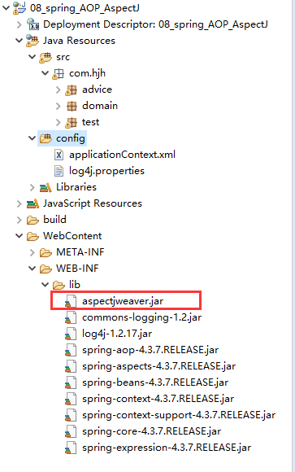

[TOC]

# 1、Spring的概述

## 1.1名称说明

**spring** ：春天   程序员的春天

​	|--springmvc 

​	|--springboot

​	|--springclould

​	|--spring data

## 1.2spring的核心

**spring就是一个容器**

​	IOC  /DI   

​	|-- IOC全称为：Inverse of Control

​	|--DI 依赖注入）：全称为Dependency Injection

​	AOP

​		|-- AOP为Aspect Oriented Programming的缩写  面向切面编程

AOP：面向切面编程。扩展功能而不修改源代码。

IOC：控制反转，降低耦合度。如果调用一个类中的方法，需要new对象然后才可以调用；在spring的IoC种，可以将代码new对象的操作交给spring的配置文件来完成。


l Spring在JavaWeb三层结果中，每一层都提供了不同的解决技术。

l Web层：SpringMVC

l Service层：Spring ioc

l Dao层：Spring jdbc Template ==> mybatis


## 1.3spring框架图


# 2、传统的javaEE的三层写法

数据访问层   

​		|--jdbc  hibernate  com.sxt.dao.impl

​		|--mybtais    com.sxt.mapper  com.sxt.mapping[可以和mapper合并]

业务层 

​		|--service  

​				|--com.sxt.service.impl 

​				|--com.sxt.biz.impl

WEB层

​		|--web层   com.sxt.servlet

​					 com.sxt.action

​					 com.sxt.controller

实体类

​		|-- jdbc  hibernate  com.sxt.bean  com.sxt.entity  com.sxt.pojo

​		|--mybtais  com.sxt.pojo  com.sxt.domain


# 5、Spring属性注入配置详解

创建Person

```java
package com.hjh.domain;

import java.util.List;

public class Person {

	private List<String> strList;
	private List<User> userList;

	public List<String> getStrList() {
		return strList;
	}

	public void setStrList(List<String> strList) {
		this.strList = strList;
	}

	public List<User> getUserList() {
		return userList;
	}

	public void setUserList(List<User> userList) {
		this.userList = userList;
	}

}
```

# 2.2cglib动态代理

特点：目标对象没有实现接口也可以进行代理

```
上面的静态代理和动态代理模式都是要求目标对象是实现一个接口的目标对象,但是有时候目标对象只是一个单独的对象,并没有实现任何的接口,这个时候就可以使用以目标对象子类的方式类实现代理,这种方法就叫做:Cglib代理

Cglib代理,也叫作子类代理,它是在内存中构建一个子类对象从而实现对目标对象功能的扩展.

JDK的动态代理有一个限制,就是使用动态代理的对象必须实现一个或多个接口,如果想目标没有实现接口的类,就可以使用Cglib实现.


Cglib是一个强大的高性能的代码生成包,它可以在运行期扩展java类与实现java接口.它广泛的被许多AOP的框架使用,例如Spring AOP和synaop,为他们提供方法的interception(拦截)


Cglib包的底层是通过使用一个小而块的字节码处理框架ASM来转换字节码并生成新的类.不鼓励直接使用ASM,因为它要求你必须对JVM内部结构包括class文件的格式和指令集都很熟悉.


Cglib子类代理实现方法:


1.需要引入cglib的jar文件,但是Spring的核心包中已经包括了Cglib功能,所以直接引入spring-core-3.2.5.jar即可.


2.引入功能包后,就可以在内存中动态构建子类


3.代理的类不能为final,否则报错


4.目标对象的方法如果为final/static,那么就不会被拦截,即不会执行目标对象额外的业务方法.
```

mybatis

```java
SqlSessionFactory factory = new SqlSessionFactoryBuilder.build("/mybatis.cfg.xml");

SqlSession sqlSession = factory.openSession();

//通过cglib获取到代理对象
UserMapper userMapper = sqlSession.getMapper(UserMapper.class);
```

cglib的实现原理(继承)：在内存当中构造一个目标对象的子类对象，返回一个目标对象的子类对象代理对象

案例

1、创建项目并导包

asm-4.2.jar

cglib-3.1.jar

2、创建目标类

```java
package com.hjh.dao.impl;


public class PersonDaoImpl {

	public void update() {
		System.out.println("正在更新中");
	}

}

```

```java
package com.hjh.dao.impl;


public class UserDaoImpl {

	public void save() {
		System.out.println("保存过程中~~~");
	}

	public void delete() {
		System.out.println("删除过程");
	}

	public void update() {
		System.out.println("正在更新中");
	}
}
```

3、创建代理工厂

```java
package com.hjh.proxy;

import java.lang.reflect.Method;

import net.sf.cglib.proxy.Enhancer;
import net.sf.cglib.proxy.MethodInterceptor;
import net.sf.cglib.proxy.MethodProxy;

/**
 * 代理工厂
 * @author hjh
 *
 */
public class ProxyFactory implements MethodInterceptor {
	/**
	 * 目标对象
	 */
	private Object target;
	
	/**
	 * 初始化目标对象
	 * @param target
	 */
	public ProxyFactory(Object target) {
		this.target = target;
	}

	/**
	 * 获取代理对象的方法
	 */
	public Object getProxyInstance() {
		// 1、创建一个子类对象的构造器
		Enhancer enhancer = new Enhancer();
		
		// 2、设置父类
		enhancer.setSuperclass(target.getClass());
		
		// 3、设置回调，就是当前的工厂对象      -- 去调用拦截的方法     -- this => new ProxyFactory();
		enhancer.setCallback(this);
		
		// 4 、在内存里面生成代理对象
		return enhancer.create();
		
	}

	/**
	 *  拦截的方法
	 * arg0 : 目标对象
	 * arg1: 目标对象的方法
	 * arg2:参数
	 * arg3:代理的方法(cglib本质是继承，继承了的方法)
	 */
	@Override
	public Object intercept(Object arg0, Method arg1, Object[] arg2, MethodProxy arg3) throws Throwable {
		startTransaction();
		Object invoke = arg1.invoke(target, arg2);
		endTransaction();
		return invoke;
	}
	
	/*
	 * 开启前置增强
	 */
	public void startTransaction() {
		System.out.println("开启事务");
	}
	
	/*
	 * 开启后置增强
	 */
	public void endTransaction() {
		System.out.println("提交事务");
		System.out.println("关闭资源");
	}
}

```

4、测视类

```java
package com.hjh.test;

import com.hjh.dao.impl.UserDaoImpl;
import com.hjh.proxy.ProxyFactory;

public class TestUser {
	public static void main(String[] args) {
		// 1、创建目标对象
		UserDaoImpl userDaoImpl = new UserDaoImpl();
		
		// 2、创建代理工厂
		ProxyFactory proxyFactory = new ProxyFactory(userDaoImpl);
		
	    // 3、创建代理对象
		//Object proxyInstance = proxyFactory.getProxyInstance();
		UserDaoImpl impl = (UserDaoImpl) proxyFactory.getProxyInstance();
		
		//System.out.println(proxyInstance.getClass().getSimpleName()); // UserDaoImpl$$EnhancerByCGLIB$$1758e3be
		impl.delete();
	}
}

```

总结

```
在Spring的AOP编程中:

如果加入容器的目标对象有实现接口,用JDK代理

如果目标对象没有实现接口,用Cglib代理
```

# 3、普通AOP开发(XML方式)

AOP目的：对类里面的方法进行加强

如果要对com.hjh.service.iml进行增强，那么这个包就是切面


案例

1、创建项目并导包



2、创建Man

```java
package com.hjh.domain;
/**
 *  目标类
 * @author hjh
 *
 */
public class Man {
	
	public void eat() {
		System.out.println("人吃饭");
	}
	
}
```

3、配置ApplicationContext.xml

导入头文件

```xml
<?xml version="1.0" encoding="UTF-8"?>
<!-- 头文件 -->
<beans xmlns="http://www.springframework.org/schema/beans"
	xmlns:xsi="http://www.w3.org/2001/XMLSchema-instance" 
	xmlns:context="http://www.springframework.org/schema/context"
	xmlns:aop="http://www.springframework.org/schema/aop"
	xsi:schemaLocation="http://www.springframework.org/schema/beans
        http://www.springframework.org/schema/beans/spring-beans.xsd
        http://www.springframework.org/schema/context
	    http://www.springframework.org/schema/context/spring-context.xsd
	    http://www.springframework.org/schema/aop
        http://www.springframework.org/schema/aop/spring-aop.xsd">
	
	
</beans>
```

4、前置通知

4.1创建MyBeforeAdvice

```java
package com.hjh.advice;

import java.lang.reflect.Method;

import org.springframework.aop.BeforeAdvice;
import org.springframework.aop.MethodBeforeAdvice;
/**
 * 	前置增强
 * @author hjh
 *
 */
public class MyBeforeAdvice implements MethodBeforeAdvice {

	/**
	 * arg0：目标方法
	 * arg1：方法参数
	 * arg2：目标对象
	 */
	@Override
	public void before(Method arg0, Object[] arg1, Object arg2) throws Throwable {
		before();
	}
	
	/*
	 * 开启前置增强
	 */
	public void before() {
		System.out.println("前置增强");
	}
	
	/*
	 * 开启后置增强
	 */
	/*
	 * public void endTransaction() { System.out.println("提交事务");
	 * System.out.println("关闭资源"); }
	 */
	
}

```

4.2配置ApplicationContext.xml

```xml
<?xml version="1.0" encoding="UTF-8"?>
<!-- 头文件 -->
<beans xmlns="http://www.springframework.org/schema/beans"
	xmlns:xsi="http://www.w3.org/2001/XMLSchema-instance" 
	xmlns:context="http://www.springframework.org/schema/context"
	xmlns:aop="http://www.springframework.org/schema/aop"
	xsi:schemaLocation="http://www.springframework.org/schema/beans
        http://www.springframework.org/schema/beans/spring-beans.xsd
        http://www.springframework.org/schema/context
	    http://www.springframework.org/schema/context/spring-context.xsd
	    http://www.springframework.org/schema/aop
        http://www.springframework.org/schema/aop/spring-aop.xsd">

	<!-- 声明目标对象 -->
	<bean id="man" class="com.hjh.domain.Man"></bean>

	<!-- 声明通知对象 -->
	<bean id="myBeforeAdvice" class="com.hjh.advice.MyBeforeAdvice"></bean>
	
	<!-- 进行AOP的配置 
	 		expression：表达式 
	 -->
	<aop:config>
		<!-- 声明一个切面 -->
		<aop:pointcut expression="execution(* com.hjh.domain.*.*(..))" id="pc1"/>
		
		<!-- 织入操作 
			advice-ref:通知对象
			pointcut-ref：织入到哪一个切面
		-->
		<aop:advisor advice-ref="myBeforeAdvice" pointcut-ref="pc1"/>
	</aop:config>

</beans>
```

4.3测试类

```java
package com.hjh.test;

import org.springframework.context.ApplicationContext;
import org.springframework.context.support.ClassPathXmlApplicationContext;

import com.hjh.domain.Man;

public class TestUser {
	public static void main(String[] args) {
		// 1、加载spring的配置文件，初始化IOC容器
		ApplicationContext applicationContext = new ClassPathXmlApplicationContext("classpath:applicationContext.xml");
		
		// 2、获取代理对象
		Man man = applicationContext.getBean(Man.class);
		//System.out.println(man.getClass().getSimpleName()); // Man$$EnhancerBySpringCGLIB$$3dbcc30f
		man.eat();
	}
}
```

5、后置通知

创建MyAfterAdvice

```java
package com.hjh.advice;

import java.lang.reflect.Method;

import org.springframework.aop.AfterAdvice;
import org.springframework.aop.AfterReturningAdvice;
import org.springframework.aop.BeforeAdvice;
import org.springframework.aop.MethodBeforeAdvice;

/**
 *	后置增强
 * 
 * @author hjh
 *
 */
public class MyAfterAdvice implements AfterReturningAdvice {

	/**
	 * arg03：当前被加强的目标对象arg1：目标方法 arg2：方法参数 
	 */
	@Override
	public void afterReturning(Object arg0, Method arg1, Object[] arg2, Object arg3) throws Throwable {
		after();
	}

	/*
	 * 开启前置增强
	 */
	/*
	 * public void before() { System.out.println("饭前搞一杯！"); }
	 */

	/*
	 * 开启后置增强
	 */
	public void after() {
		System.out.println("饭后看电视~~~");
	}

}

```

6、环绕通知

创建AroundAdvice

```java
package com.hjh.advice;

import org.aopalliance.intercept.MethodInterceptor;
import org.aopalliance.intercept.MethodInvocation;

/**
 * 	环绕增强
 * 
 * @author hjh
 *
 */
public class AroundAdvice implements MethodInterceptor {

	/**
	 * arg0:拦截的方法
	 */
	@Override
	public Object invoke(MethodInvocation arg0) throws Throwable {
		before();
		Object proceed = arg0.proceed();
		after();
		return proceed;
	}

	/*
	 * 开启前置增强
	 */
	public void before() {
		System.out.println("饭前搞一杯！");
	}

	/*
	 * 开启后置增强
	 */
	public void after() {
		System.out.println("饭后看电视~~~");
	}

}

```

7、异常通知

创建MyThrows

```java
package com.hjh.advice;

import org.springframework.aop.ThrowsAdvice;

/**
 *  异常的增强类
 * @author hjh
 *
 */
public class MyThrows implements ThrowsAdvice {
	
	/**
	 *	 接收目标方法发生的异常
	 * @param throwable
	 */
	public void afterThrowing(Throwable throwable) throws Throwable {
		System.out.println("发生的异常："+throwable.getMessage());
	}
	
}
```

**注意：此处的方法名必须是afterThrowing**

**8、配置ApplicationContext.xml （重点）**

```xml
<?xml version="1.0" encoding="UTF-8"?>
<!-- 头文件 -->
<beans xmlns="http://www.springframework.org/schema/beans"
	xmlns:xsi="http://www.w3.org/2001/XMLSchema-instance" 
	xmlns:context="http://www.springframework.org/schema/context"
	xmlns:aop="http://www.springframework.org/schema/aop"
	xsi:schemaLocation="http://www.springframework.org/schema/beans
        http://www.springframework.org/schema/beans/spring-beans.xsd
        http://www.springframework.org/schema/context
	    http://www.springframework.org/schema/context/spring-context.xsd
	    http://www.springframework.org/schema/aop
        http://www.springframework.org/schema/aop/spring-aop.xsd">

	<!-- 声明目标对象 -->
	<bean id="man" class="com.hjh.domain.Man"></bean>

	<!-- 声明通知对象 -->
	<bean id="myBeforeAdvice" class="com.hjh.advice.MyBeforeAdvice"></bean>
	<bean id="myAfterAdvice" class="com.hjh.advice.MyAfterAdvice"></bean>
	<bean id="aroundAdvice" class="com.hjh.advice.AroundAdvice"></bean>
	<bean id="myThrows" class="com.hjh.advice.MyThrows"></bean>
	
	<!-- 进行AOP的配置 
	 		expression：表达式 
	 -->
	<aop:config>
		<!-- 声明一个切面 -->
		<aop:pointcut expression="execution(* com.hjh.domain.*.*(..))" id="pc1"/>
		
		<!-- 织入操作 
			advice-ref:通知对象
			pointcut-ref：织入到哪一个切面
		-->
		<!-- <aop:advisor advice-ref="myBeforeAdvice" pointcut-ref="pc1"/> -->
		<!-- <aop:advisor advice-ref="myAfterAdvice" pointcut-ref="pc1"/> -->
		<!-- <aop:advisor advice-ref="aroundAdvice" pointcut-ref="pc1"/> -->
		<aop:advisor advice-ref="myThrows" pointcut-ref="pc1"/>
	</aop:config>

</beans>
```

9、测试类

```java
package com.hjh.test;

import org.springframework.context.ApplicationContext;
import org.springframework.context.support.ClassPathXmlApplicationContext;

import com.hjh.domain.Man;

public class TestUser {
	public static void main(String[] args) {
		// 1、加载spring的配置文件，初始化IOC容器
		ApplicationContext applicationContext = new ClassPathXmlApplicationContext("classpath:applicationContext.xml");
		
		// 2、获取代理对象
		Man man = applicationContext.getBean(Man.class);
		//System.out.println(man.getClass().getSimpleName()); // Man$$EnhancerBySpringCGLIB$$3dbcc30f
		man.eat();
	}
}

```

监控方法的执行时间：

```java
package com.hjh.advice;

import java.util.Date;

import org.aopalliance.intercept.MethodInterceptor;
import org.aopalliance.intercept.MethodInvocation;

/**
 * 	环绕增强
 * 
 * @author hjh
 *
 */
public class AroundAdvice implements MethodInterceptor {

	/**
	 * arg0:拦截的方法
	 */
	@Override
	public Object invoke(MethodInvocation arg0) throws Throwable {
		before();
		long startTime = System.currentTimeMillis();
		Object proceed = arg0.proceed();
		long endTime = System.currentTimeMillis();
		System.out.println("监控方法执行耗时："+(endTime - startTime) + "ms");
		after();
		return proceed;
	}

	/*
	 * 开启前置增强
	 */
	public void before() {
		System.out.println("饭前搞一杯！");
	}

	/*
	 * 开启后置增强
	 */
	public void after() {
		System.out.println("饭后看电视~~~");
	}

}
```

# 4、使用AspectJ AOP开发(XML方式)

**什么是aspectJ**

AspectJ是一个基于Java语言的AOP框架，Spring2.0开始引入对AspectJ的支持，AspectJ扩展了Java语言，提供了专门的编译器，在编译时提供了横向代码的注入。

@AspectJ是AspectJ1.5新增功能，通过JDK1.5注解技术，允许直接在Bean中定义切面

新版本的Spring中，建议使用AspectJ方式开发AOP

**aspectJ开发两种方式**

​	  基于xml配置文件方式开发

  	基于注解方式的开发

**创建增强类(通知类)**

```java
package com.hjh.advice;

import org.aspectj.lang.ProceedingJoinPoint;

public class MyAdvice {
	/**
	 * 	前置通知
	 */
	public void before() {
		System.out.println("饭前玩游戏");
	}
	
	/**
	 * 	后置通知
	 */
	public void after() {
		System.out.println("饭后踢足球");
	}
	
	/**
	 * 	环绕通知
	 */
	public Object around(ProceedingJoinPoint joinPoint) {
		Object object = null;
		before();
		try {
			object = joinPoint.proceed();
		} catch (Throwable e) {
			e.printStackTrace();
		}
		after();
		return object;
	}
	
	/**
	 * 异常通知
	 */
	public void throwing(Throwable throwable) {
		System.out.println("异常："+throwable.getMessage());
	}
	
}
```


**创建目标类**

```java
package com.hjh.domain;
/**
 *  目标类
 * @author hjh
 *
 */
public class Man {
	
	public void eat() {
		System.out.println("人吃饭");
		int a = 1/0;
	}
	
}

```

**配置applicationContext.xml**

```xml
<?xml version="1.0" encoding="UTF-8"?>
<!-- 头文件 -->
<beans xmlns="http://www.springframework.org/schema/beans"
	xmlns:xsi="http://www.w3.org/2001/XMLSchema-instance" 
	xmlns:context="http://www.springframework.org/schema/context"
	xmlns:aop="http://www.springframework.org/schema/aop"
	xsi:schemaLocation="http://www.springframework.org/schema/beans
        http://www.springframework.org/schema/beans/spring-beans-3.0.xsd
        http://www.springframework.org/schema/context
	    http://www.springframework.org/schema/context/spring-context.xsd
	    http://www.springframework.org/schema/aop
        http://www.springframework.org/schema/aop/spring-aop-3.0.xsd">

	<!-- 声明目标对象 -->
	<bean id="man" class="com.hjh.domain.Man"></bean>

	<!-- 声明通知对象 -->
	<bean id="myAdvice" class="com.hjh.advice.MyAdvice"></bean>
	
	<!-- 进行AOP的配置 
	 		expression：表达式 
	 -->
	<aop:config>
		<aop:aspect ref="myAdvice">
			<!-- 声明切面 -->
			<aop:pointcut expression="execution(* com.hjh.domain.*.*(..))" id="pc1"/>
			
			<!-- 织入操作 -->
			<!-- 前置通知 
				method ： 方法
			-->
			<!-- <aop:before method="before" pointcut-ref="pc1"/>
			<aop:after-returning method="after" pointcut-ref="pc1"/> -->
			<!-- <aop:around method="around" pointcut-ref="pc1"/> -->
			
			<!-- throwing的值必须和增强类里面方法的参数一致 -->
			<aop:after-throwing method="throwing" pointcut-ref="pc1" throwing="throwable"/>
		</aop:aspect>
	</aop:config>

</beans>
```

**测试类**

```java
package com.hjh.test;

import org.springframework.context.ApplicationContext;
import org.springframework.context.support.ClassPathXmlApplicationContext;

import com.hjh.domain.Man;

public class TestUser {
	public static void main(String[] args) {
		// 1、加载spring的配置文件，初始化IOC容器
		ApplicationContext applicationContext = new ClassPathXmlApplicationContext("classpath:applicationContext.xml");
		
		// 2、获取代理对象
		Man man = applicationContext.getBean(Man.class);
		//System.out.println(man.getClass().getSimpleName()); // Man$$EnhancerBySpringCGLIB$$3dbcc30f
		man.eat();
	}
}

```

